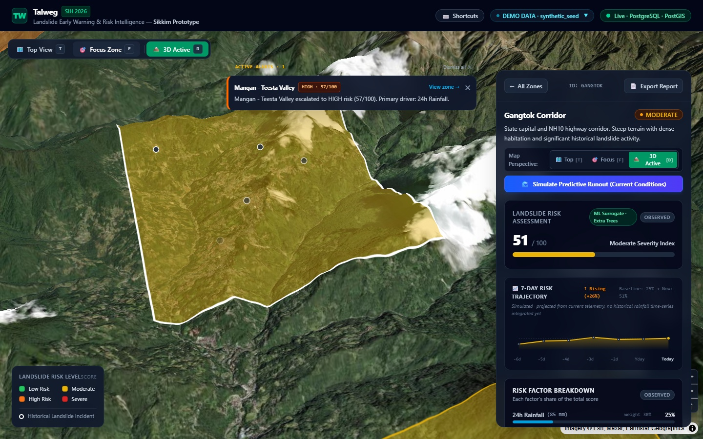
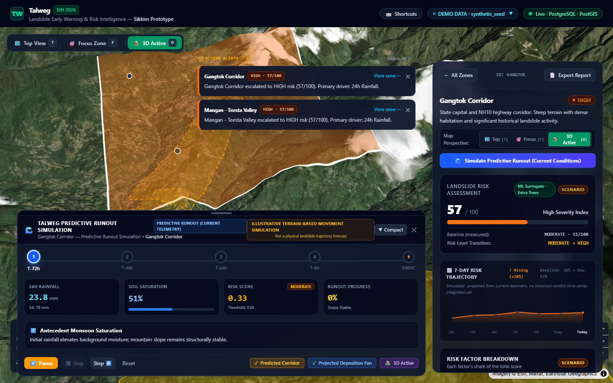
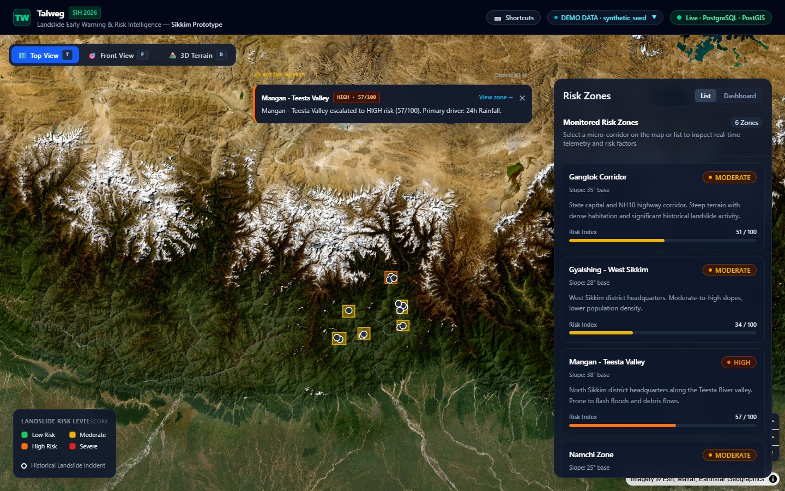
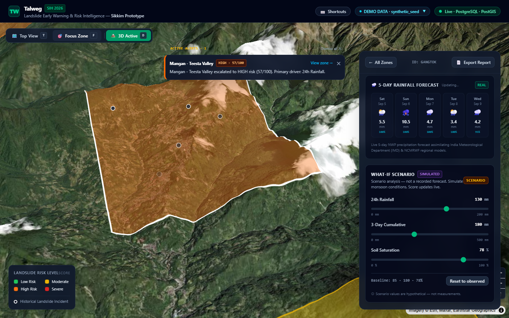
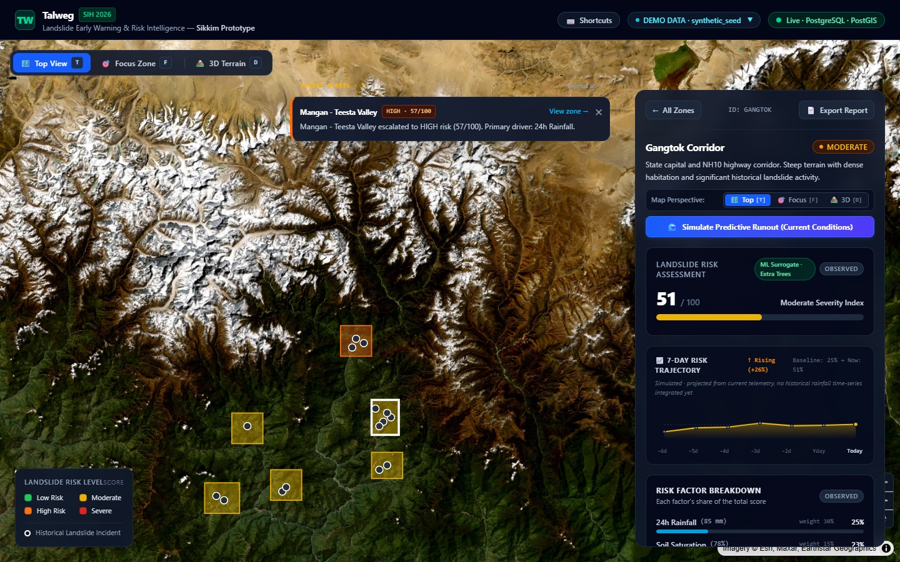
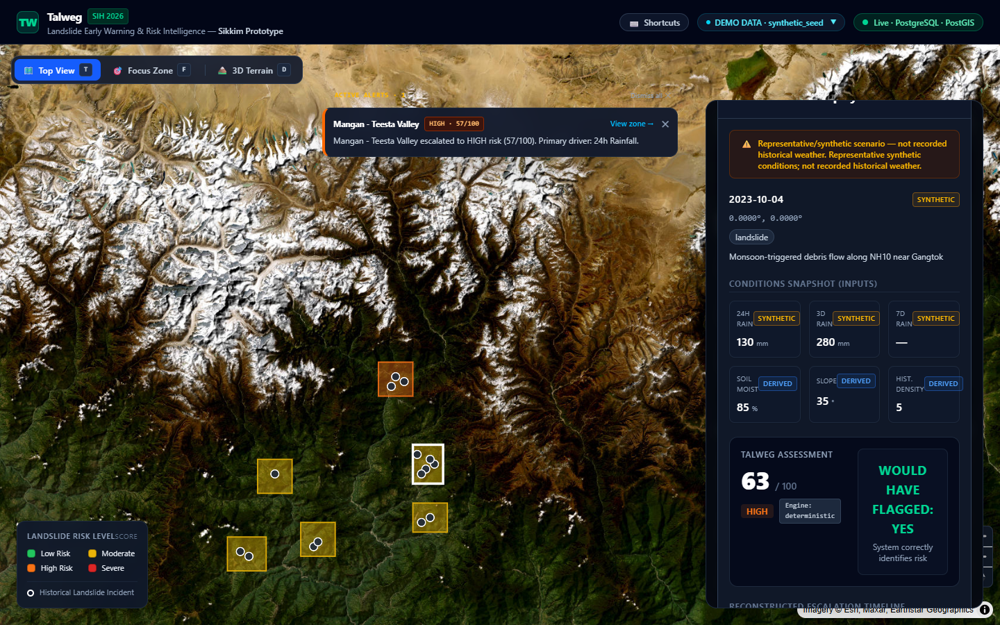

# Talweg

**AI-Based Landslide Early Warning & Risk Intelligence System for the North Eastern Region of India**

SIH26001 — Prototype decision-support system for landslide risk assessment in Sikkim.

[](https://talweg-client-production.up.railway.app)
[](https://talweg-server-production.up.railway.app/api/health)
[](https://www.sih.gov.in/)

---

### 🌐 Live Production Deployment

- 🖥️ **Interactive Web Client:** [https://talweg-client-production.up.railway.app](https://talweg-client-production.up.railway.app)
- 🔌 **API Server Health & Endpoints:** [https://talweg-server-production.up.railway.app/api/health](https://talweg-server-production.up.railway.app/api/health)

---

## 📸 Interface Showcase

### 1. 3D Terrain-Aware Hazard Visualization (Himalayan Micro-Corridors)

*High-resolution 3D relief terrain (55° pitch) rendered on MapLibre GL with AWS Terrarium DEM tiles, capturing steep Himalayan slopes, snowcapped ridgelines, and zone risk telemetry evaluated by the Extra Trees ML surrogate.*

---

### 2. Terrain-Based Hazard Progression Simulation

*Illustrative terrain-following hazard progression simulation modeling antecedent saturation, threshold crossing, descent trajectory, and projected debris fan with timeline controls and explicit non-forecast disclaimer.*

---

### 3. Statewide Geospatial Risk Intelligence (Sikkim Overview)

*Nadir top-view decision-support monitoring across all 6 administrative corridors of Sikkim with clustered historical landslide records and server-authoritative active alert dispatch.*

---

### 4. Interactive What-If Scenario Stress Testing

*Parametric stress-testing of slopes with real-time sliders for 24h precipitation, 3-day cumulative rainfall, and soil saturation to model hypothetical monsoon trigger conditions in 3D perspective.*

---

### 5. Explainable Risk Assessment & Factor Breakdown

*Transparent factor attribution breakdown (Rainfall, Soil Saturation, DEM Slope, Historical Density), 7-day risk trajectories, and dual-engine validation (Deterministic baseline vs. Extra Trees ML surrogate).*

---

### 6. Historical Reconstruction & Retrospective Replay

*Retrospective evaluation of documented historical landslide events against the risk engine, featuring provenance-tagged input vectors (REAL / DERIVED / SYNTHETIC), escalation timelines, and decision verification ("WOULD HAVE FLAGGED: YES").*

---

> **⚠️ Prototype disclaimer:** This is a decision-support prototype built for SIH 2026. It is NOT an operational emergency warning system and must NOT be used as one.

## Tech Stack

| Layer | Technology |
|---|---|
| Frontend | React 19, Vite 6, TypeScript, Tailwind CSS v4, MapLibre GL JS, Recharts |
| Backend | Node.js 20, Express, TypeScript, Zod, pg |
| Database | PostgreSQL 16 + PostGIS 3.4 |
| ML (Sidecar) | Python 3.11/3.14, FastAPI, Scikit-Learn (ExtraTreesRegressor surrogate model) |

## Architecture

```
React/Vite (client :5173)
    ↓ REST/JSON
Node/Express (server :3001)
    ↓ SQL
PostgreSQL/PostGIS (:5432)

Node/Express
    ↓ internal HTTP (127.0.0.1:8000 only)
FastAPI ML surrogate service (:8000)
```

The browser communicates **only** with the Node/Express backend.
FastAPI is an internal service for ML inference only — never browser-accessible.
If the ML service is down or times out, Node/Express automatically and silently falls back to the in-process deterministic risk engine with zero downtime.

## Quick Start

### Prerequisites

- Node.js 20+
- Docker & Docker Compose (for PostgreSQL/PostGIS and ML sidecar)
- Python 3.11+ (if running ML service locally outside Docker)

### Setup

```bash
# 1. Start the database (and optionally ML service)
docker compose up -d

# 2. Configure environment
cp .env.example .env

# 3. Install dependencies
cd server && npm install
cd ../client && npm install
cd ../ml-service && pip install -r requirements.txt

# 4. Run migrations and seed data
cd server && npm run migrate
cd server && npm run seed

# 5. Run tests (155 automated tests across all tiers)
cd server && npm test         # 115 tests
cd ../client && npm test      # 35 tests
cd ../ml-service && pytest    # 5 tests

# 6. Start the backend
cd server && npm run dev

# 7. Start the frontend (separate terminal)
cd client && npm run dev
```

Open http://localhost:5173 in your browser.

## Project Status

- [x] **Phase 0:** Project scaffolding & foundation
- [x] **Phase 1:** PostGIS schema + seed data + deterministic risk engine
- [x] **Phase 2:** REST API endpoints (P0-A)
- [x] **Phase 3:** React GIS dashboard & satellite map (P0-A)
- [x] **Phase 4:** Live rainfall scenario simulator & sequence guards (P0-A)
- [x] **P0-B.1:** Risk factor contribution breakdown & explainability
- [x] **P0-B.2:** Server-authoritative alert generation & active alert banner
- [x] **P0-B.3:** Grounded AI Copilot with zero-dependency deterministic fallback
- [x] **Phase 5:** Honestly-scoped ML surrogate sidecar & live failover seam
- [x] **Phase 6:** SIH competitive package (Response guidance, Zone comparison dashboard, PDF reports, 7-day risk sparkline, 5-day weather forecast, alert audit log, stakeholder escalation chain, data source dashboard, keyboard shortcuts, skeleton loaders)

## Documentation

- [API Contracts](docs/api_contracts.md) — Comprehensive REST specifications and response schemas
- [100-Second Demo Script](docs/demo_script.md) — Step-by-step presentation and recording script
- [Data Sources & Provenance](docs/data_sources.md) — NER region selection scorecard and provenance classification
- [Architecture](docs/architecture.md) — Monorepo system architecture and design principles

## Data Provenance

All data in this prototype is classified as:
- **REAL** — sourced from published datasets (NASA GLC, CHIRPS, SRTM)
- **DERIVED** — computed from real data (e.g., slope from DEM)
- **SYNTHETIC** — clearly labelled demo/seed data for development

## License

Internal project — SIH 2026.
